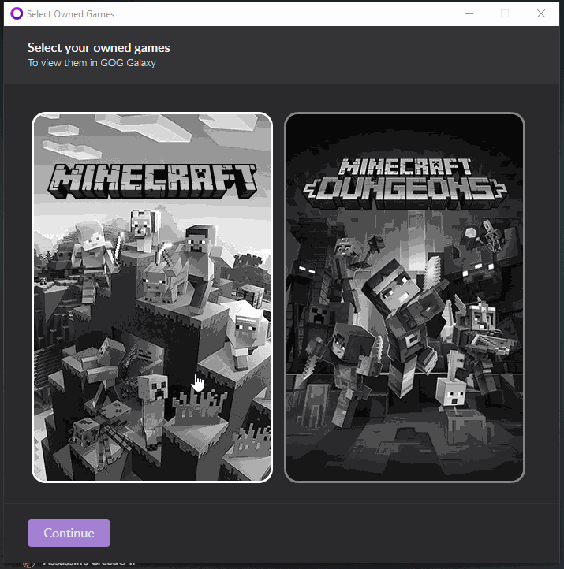

# GOG Galaxy Minecraft Integration

An Minecraft integration for GOG Galaxy 2.0.

Note: I haven't tested it on mac yet but it should work.

## Build

`python build.py -r` This will make a zip with the integration and all necessary packages for the operating system run on. You can specify a platform but I've found that to not work well when building for another platform on a platform (eg. building for mac on windows). For more information run `python build.py -h`.

If you want to enable GUI for downloading and yes-no popups change `more-galaxy-utils==0.1.1` to `more-galaxy-utils[gui]==0.1.1`.

## FAQ

_How to change what games I own?_ Just disconnect and reconnect. The play time should be kept. If there is an issue please submit an issue.
